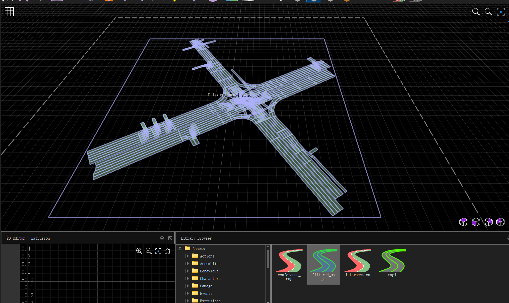

# HDmap-to-Roadrunner
This code covert high definition vector map to Mathworks RoadRunner, which is basiclly a way to combine the advantage of Carla digital twin tool and HDmap dataset as I concern right now.

Your HDM dataset covert into .rrhd file then rendered by Roadrunner with a fucking crazy result, as shown below.

There are space between road-net which is different form realistic, grass were grow on the street, all the fucking fancy things happened on the screen...

# Filtered map4
